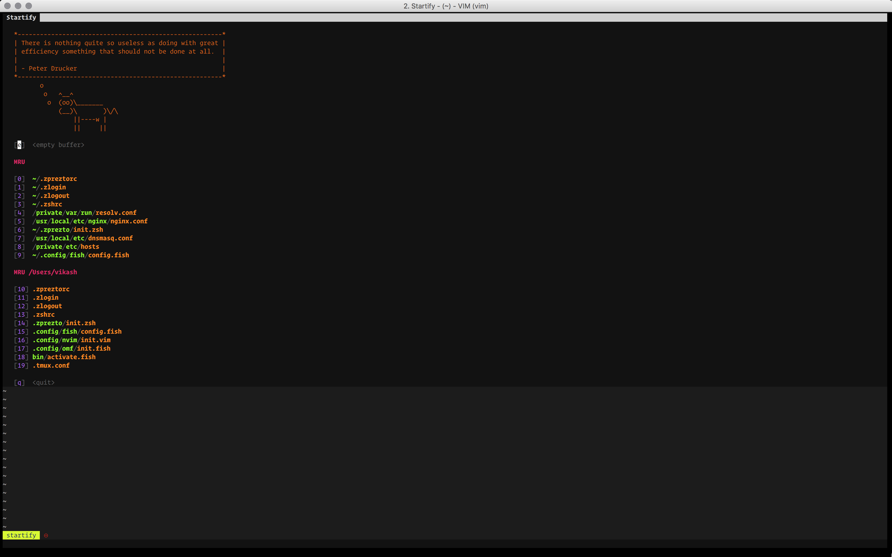
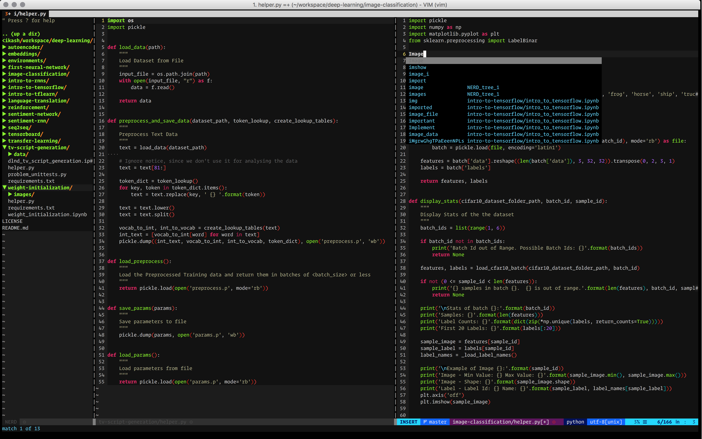
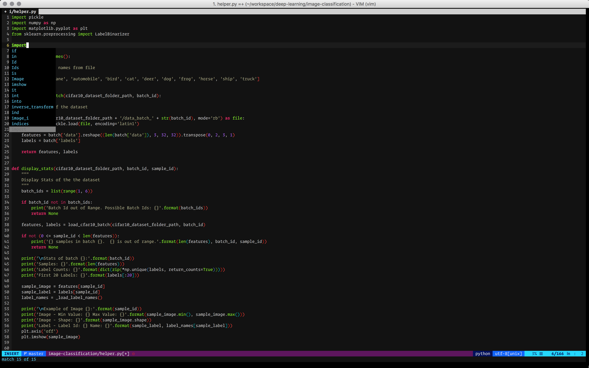
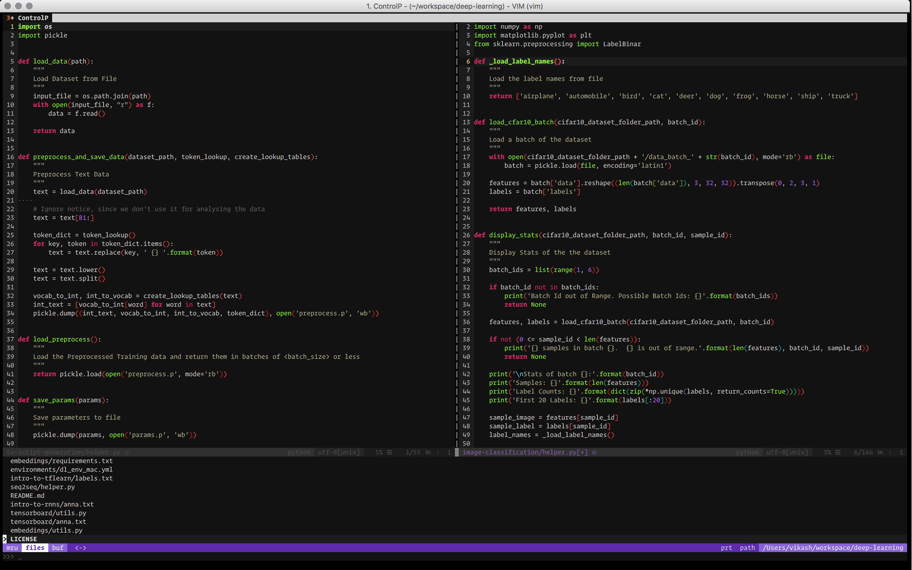

# (Neo) Vim Configurations

This is a basic `vim` and `neovim` configurations. At this stage of vim, you would need tern server for better `Javascript` completions. This repository is a still on its way to become mature but please feel free to use it.

## Screenshots





## Installation

```bash

# Create neovim config folder if not already present
mkdir -p ~/.config/nvim

# Create a common vimslug folder for vim and neovim
mkdir -p ~/.vim/bundle/vundle

# Let's backup the configurations
for i in ~/.vim ~/.vimrc ~/.gvimrc ~/.config/nvim; do [ -e $i ] && mv $i $i.old; done

# Lets clone this repo
git clone git://github.com/ivikash/dotvim.git ~/.vim

# Copy to vimconfig file
cp ~/.vim/vimrc ~/.vimrc

# Copy the config to neovim
cp ~/.vimrc ~/.config/nvim/init.vim

git clone https://github.com/VundleVim/Vundle.vim ~/.vim/bundle/vundle

vim +'PluginInstall!' +qall
nvim +'PluginInstall!' +qall

```
### Note :
* `In case you are getting errors from Rainbow Parenthesis then disable it from
from the .vimrc before PluginInstall and re-enable it`
* Please ensure YouCompleteMe is installed and running.
